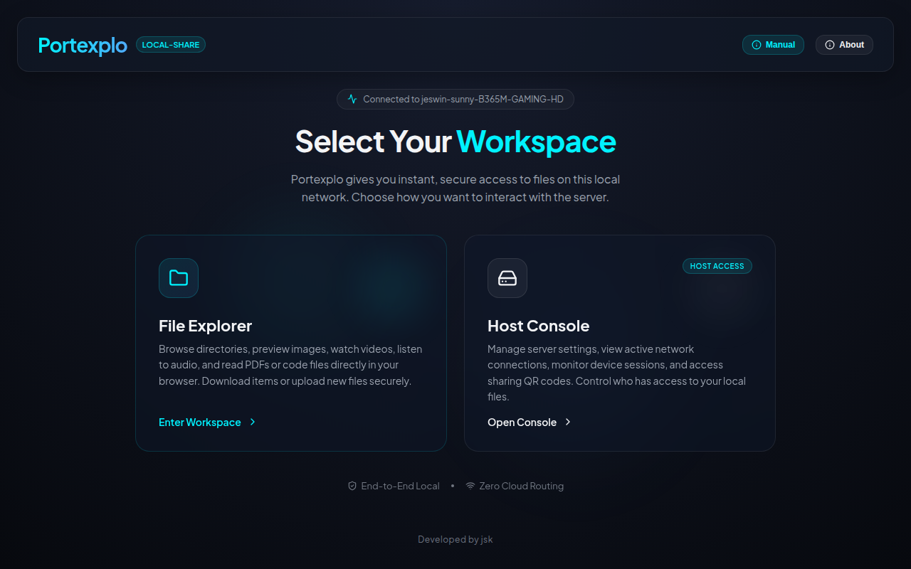
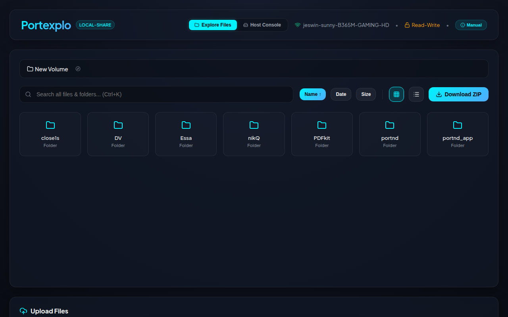
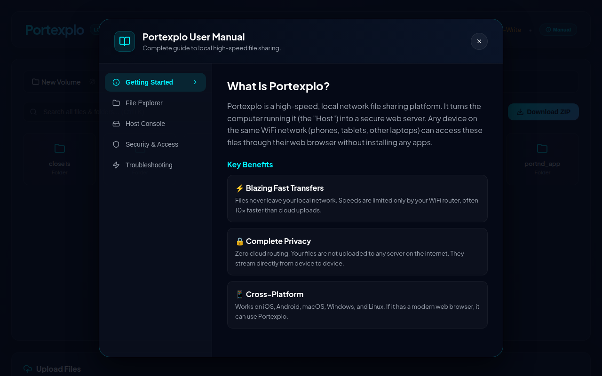

<div align="center">
  
# 🚀 Portexplo

**High-Performance Local File Sharing & Administration Server**

[](https://nodejs.org/)
[](https://react.dev/)
[](LICENSE)
[](#)

*Portexplo transforms any local directory into a secure, instantly accessible file server. Stream media, share documents, and manage remote devices with absolute privacy on your local network.*

[Features](#-key-features) • [Quick Start](#-quick-start) • [Usage](#-cli-usage) • [Security](#-security) • [API](#-api-reference)

</div>

---

## ✨ Key Features

Portexplo is built for speed, security, and a premium user experience without the need for cloud uploads. 

### 🗂️ Advanced File Management
- **Instant Local Sharing** — Turn any folder into a web-accessible server instantly.
- **Deep Recursive Search** — Press `Ctrl+K` to search through directories up to 8 levels deep.
- **Batch Operations** — Select multiple items and click **Download ZIP** to grab them instantly.
- **Two-Way Transfers** — Enable `--write` mode to allow remote devices to upload, rename, and delete files.
- **On-Server Extraction** — Unzip uploaded archives directly on the host machine.

### 🎥 Native Media Streaming
- **True Media Streaming** — Advanced HTTP Range Request support for instant scrubbing through large 4K video and audio files without buffering into RAM.
- **Audio Visualizer** — Built-in premium music player with live frequency bars and vinyl animations.
- **PDF Presenter Mode** — Read and present PDF documents directly in the browser.
- **Code Highlighting** — Native text and code viewer for quick file inspections.

### 🛡️ Absolute Security Control
- **Host Approval (Waiting Room)** — Remote devices are held in a secure waiting area until the host explicitly clicks "Accept" to grant access.
- **Passcode Protection** — Lock your server behind a secure PIN for a secondary layer of authentication.
- **Host Auto-Authorization** — The machine hosting the server bypasses all security automatically.
- **Real-Time Revocation** — View active and pending devices in the Host Console to instantly kick unauthorized users.
- **Read-Only by Default** — Remote modifications are strictly opt-in.

### 🌐 Administration & Access
- **Host Console** — A dedicated admin dashboard for monitoring connections and server health.
- **Dynamic Global Access** — Click a button in the UI to instantly generate a public `loca.lt` URL, exposing your server to the world without router configuration or server reboots.
- **Storage Insights** — Scan directories to see visual breakdowns of file types taking up space.
- **QR Code Pairing** — Scan the generated QR code to auto-authenticate mobile devices instantly.

---

## 📸 Screenshots

<div align="center">
  
  <br/>
  <em>Modern, premium glassmorphic interface designed for clarity and speed.</em>
</div>

<br/>

<div align="center">
  
  <br/>
  <em>Navigate directories, stream media natively, and upload files instantly.</em>
</div>

<br/>

<div align="center">
  
  <br/>
  <em>Comprehensive, built-in User Manual explaining features and troubleshooting.</em>
</div>

---

## 🚀 Quick Start

### 1. Clone & Install
```bash
git clone https://github.com/jeswintesting-spec/Portexplo.git
cd portexplo

# Install server dependencies
npm install

# Install client dependencies
npm run client-install
```

### 2. Build the Frontend UI
```bash
npm run build
```

### 3. Start the Server

**One-Click Startup (Recommended):**
Inside the project folder, simply double-click the startup script for your operating system:
- 🪟 **Windows**: Double-click `start-windows.bat`
- 🍎 **macOS**: Double-click `start-mac.command`
- 🐧 **Linux**: Run `./start-linux.sh`

These scripts will automatically boot the server and open the web dashboard in your default browser!

**Manual Startup (CLI):**
```bash
# Start on default port 5050 in Read-Only mode
npm start
```
*Open **http://localhost:5050** in your web browser!*

---

## 💻 CLI Usage

Portexplo is controlled entirely via a powerful command-line interface:

```bash
node server.js [options]
```

| Option | Short | Description |
|--------|-------|-------------|
| `--port <n>` | `-p` | Port to listen on (default: `5050`) |
| `--dir <path>` | `-d` | Directory to share (default: `./shared`) |
| `--write` | `-w` | Enable remote upload, delete, and rename (default: `false`) |
| `--passcode <pin>` | `-c` | Require a PIN to access the server from remote devices |
| `--tunnel` | `-t` | Expose globally via LocalTunnel |

### Common Examples

**Secure Read-Write Collaboration:**
```bash
# Share the Desktop folder, allow uploads, and lock with PIN 9988
node server.js -d ~/Desktop -w -c 9988
```

**Worldwide Access:**
```bash
# Expose your downloads folder to the internet (auto-generates a secure PIN)
node server.js -d ~/Downloads -t
```

---

## 🏗️ Architecture

Portexplo uses a decoupled Node.js backend and a React/Vite frontend.

```text
portexplo/
├── server.js          # Express backend (API, Security, File I/O)
├── client/            # React 19 Frontend
│   ├── src/
│   │   ├── components/
│   │   │   ├── FileExplorer.jsx    # Core file management
│   │   │   ├── DeviceManager.jsx   # Session revocation
│   │   │   ├── UserManual.jsx      # In-app documentation
│   │   │   ├── AudioVisualizer.jsx # Web Audio API integration
│   │   │   └── ...
│   │   └── App.jsx
│   └── dist/          # Compiled static frontend assets
└── shared/            # Default directory (created automatically)
```

---

## 🔌 API Reference

Portexplo offers a robust internal REST API.

### Public Endpoints
- `GET /api/config` - Server capability and network discovery

### Protected Endpoints (Require Passcode)
- `GET /api/files` - List directory contents
- `GET /api/search?q=...` - Deep recursive file search
- `GET /api/download` - Download files or batch ZIP folders
- `POST /api/upload` - Handle `multipart/form-data` uploads (requires `--write`)
- `POST /api/zip-selected` - Batch ZIP compression
- `POST /api/extract-zip` - Native archive extraction

### Host Administration (Admin Only)
- `GET /api/admin/sessions` - List all active and pending remote devices
- `POST /api/admin/sessions/approve` - Approve a pending device from the waiting room
- `POST /api/admin/sessions/revoke` - Instantly terminate a specific device session
- `POST /api/admin/tunnel/start` - Dynamically initialize a public global tunnel
- `POST /api/admin/tunnel/stop` - Safely shut down the active public global tunnel
- `POST /api/admin/set-root` - Change the root sharing directory on the fly
- `GET /api/admin/storage` - Generate a recursive storage consumption report

### Emergency Access (Localhost Only)
- `GET /api/host-recovery` - Bypasses auth to reveal the passcode (only responds to `127.0.0.1`)

---

## 🛠️ Development

Want to contribute or modify Portexplo? 

```bash
# 1. Run the backend with hot-reload (Nodemon)
npm run dev

# 2. In a separate terminal, start the Vite frontend server
cd client
npm run dev
```
*(The Vite dev server automatically proxies `/api` requests to the Node.js backend).*

---

## 📜 License

This project is licensed under the **MIT License**. See the [LICENSE](LICENSE) file for details.

<br/>
<div align="center">
  <sub>Built with ❤️ for secure local networking. Developed by jsk.</sub>
</div>
